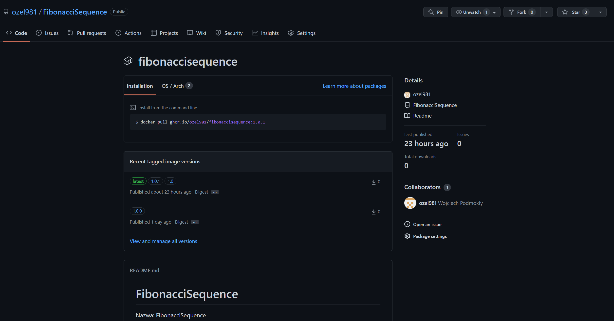

# FibonacciSequence
Nazwa: FibonacciSequence 
Autor: Wojciech Podmokły 
Grupa dziekńska: 2.3 

# Program [Ad. p1]

Program fibonacciSequence.c wczytuje ze standardowego wejścia numer i zwraca wartość ciągu Fibonacciego o tym numerze z przedziału <1,60>. 
Program wykorzystuje w tym celu programowanie dynamiczne, czyli zmodyfikowaną wersje algorytmu rekurencyjnego. Polega ona na tym, że zapisujemy wyniki do tablicy dla kolejnych poziomów zagnieżdżania rekurencyjnego, dzięki czemu unikamy wielokrotnego liczenia wartości dla tych samych numerów sekwencji. 

# Utworzenie repozytorium [Ad. p1]

W celu utworzenia repozytorium lokalnie, w folderze projektu, używamy komendy `git init`. 

Następnie logujemy się przy pomocy `gh auth login`. 

Ostatecznie dodajemy lokalne repozytorium na GitHub przy pomocy komendy `gh repo create`. 

W efekcie na GitHub pojawiło sie obecje repozytorium. 

# Stworzenie i uruchomienie obrazu dockera z apliakcją [Ad. p2]

Do zbudowania obrazu należy wykorzystać dockerfile znajdujący się na tym repozytorium.  
Zbudować obraz należy poleceniem `docker build -t fibonacci-sequence .`, które tworzy obraz o nazwie fibonacci-sequence. 
Aby uruchomić obraz używamy komendy `docker run -i -a stdout -a stdin fibonacci-sequence`. 
Efektem jest uruchomienie kontenera z aplikacją która oczekuje na podanie numeru ciągu Fibonacciego.

Przeprowadzone testy pokazują, że aplikacja działa zgodnie z założeniami.

# Plik fib.yml [Ad. p3]

Plik fib.yml zapewnia poprawne dziłanie akcji GitHub. Po wykonaniu push z tagiem wersji uruchamia się workflow który powoduje zbudowanie obrazu i dodanie go z odpowiednią wersją (zgodną z semver) na docker hub i ghcr.io.   

Dodanie wersji. 

# Cache [Ad. p4]

Dzięki użyciu cache'a, kolejny build wykonał się o około 30% szybciej. 

# ghcr.io [Ad. p4]

Z ghcr obraz możemy pobrac przy pomocy komendy `docker pull ghcr.io/ozel981/fibonaccisequence:1.0.1`.

# Docker hub [Ad. p4]

Po wykonaniu pipeline odpowiednia wersja trafia na docker hub.  

# Sprawdzenie obrazu [Ad. p4]

W celu uruchomienia obrazu używamy komendy `docker run -i -a stdout -a stdin wojtekpodmokly/fibonaccisequence:1.0.0`, która pobieże nam obraz jeśli nie istnieje lokalnie i uruchomi nam kontener.  

Jak widzimy na powyższym obrazku po przeprowadzeniu podobnego testu jak poprzednio otrzymaliśmy wyniki potwierdzające poprawne działanie kontenera z aplikacją. 

