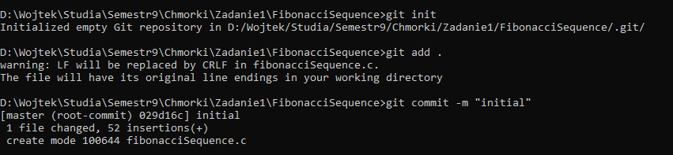
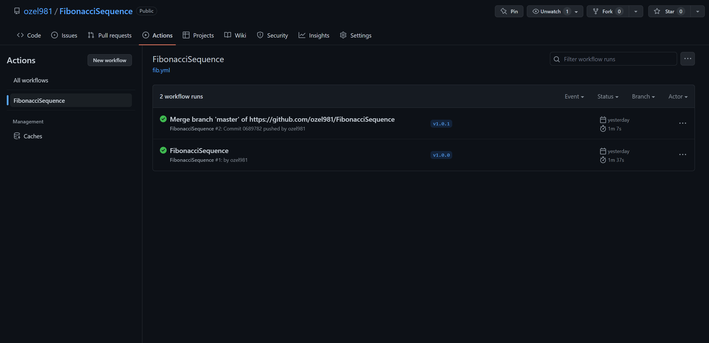
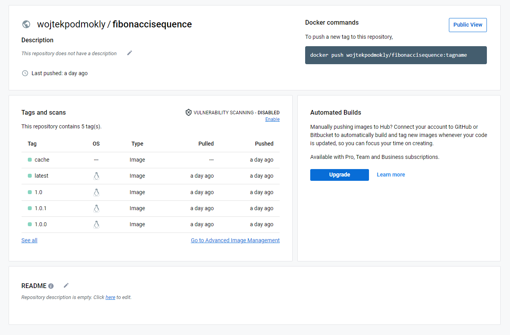

# FibonacciSequence
Nazwa: FibonacciSequence 
Autor: Wojciech Podmokły 
Grupa dziekńska: 2.3 

# Program [Ad. p1]

Program fibonacciSequence.c wczytuje ze standardowego wejścia numer i zwraca wartość ciągu Fibonacciego o tym numerze z przedziału <1,60>. 
Program wykorzystuje w tym celu programowanie dynamiczne, czyli zmodyfikowaną wersje algorytmu rekurencyjnego. Polega ona na tym, że zapisujemy wyniki do tablicy dla kolejnych poziomów zagnieżdżania rekurencyjnego, dzięki czemu unikamy wielokrotnego liczenia wartości dla tych samych numerów sekwencji. 

# Utworzenie repozytorium [Ad. p1]

W celu utworzenia repozytorium lokalnie, w folderze projektu, używamy komendy `git init`. 

Następnie logujemy się przy pomocy `gh auth login`. 

Ostatecznie dodajemy lokalne repozytorium na GitHub przy pomocy komendy `gh repo create`. 

W efekcie otrzymujemy powyższe repozytorium. 

# Stworzenie i uruchomienie obrazu dockera z apliakcją [Ad. p2]

Tworzymy Dockerfile jak powyżej.  
Następnie poleceniem `docker build -t fibonacci-sequence .` tworzymy obraz o nazwie fibonacci-sequence. 
Aby uruchomić obraz używamy komendy `docker run -i -a stdout -a stdin fibonacci-sequence`. 

Jak widzimy powyższy kod działa poprawnie.

# Plik fib.yml [Ad. p3]

Plik fib.yml zapewnia poprawne dziłanie akcji GitHub. Po wykonaniu push z tagiem uruchamia się pipline który powoduje zbudowanie obrazu i dodanie go z odpowiednią wersją na docker hub.  

Po dodaniu wersji.  

# Docker hub [Ad. p4]

Po wykonaniu pipeline odpowiednia wersja trafia na docker hub.  

# Sprawdzenie obrazu [Ad. p4]

W celu uruchomienia obrazu używamy komendy `docker run -i -a stdout -a stdin wojtekpodmokly/fibonaccisequence:1.0.0`, która (pobieże nam obraz jeśli nie istnieje) uruchomi nam kontener.

